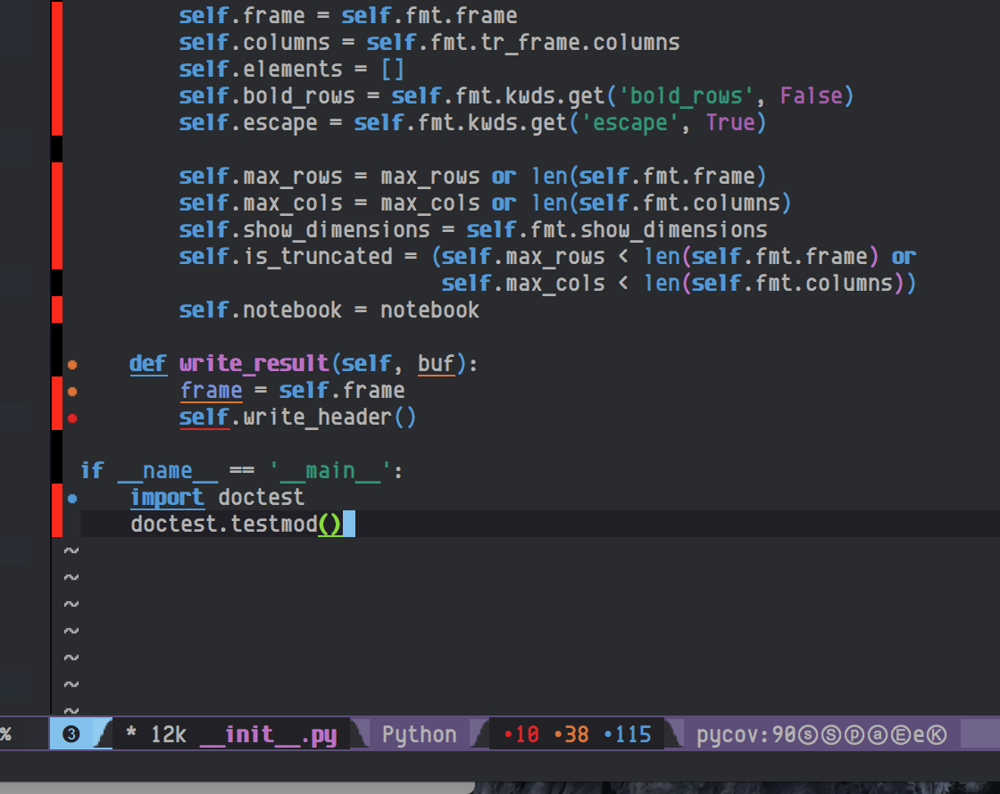

# pycoverage.el

An emacs minor mode for reporting inline on coverage stats for Python

# Dependencies

* python-coverage>=4.0

# Installation

Put something like this in your .emacs

    (require 'linum)
    (require 'pycoverage)

    (defun my-coverage ()
      (interactive)
      (when (derived-mode-p 'python-mode)
        (progn
          (linum-mode)
          (pycoverage-mode)
          )
        )
      )

I like to create a per project virtualenv. Use pip to install cov2emacs
in that virtualenv.

    $ source path/to/env/bin/activate
    (env) $ cd pycoverage.el/cov2emacs
    (env) $ pip install .

Use pyvenv mode to activate your virtualenv and you should be good to go.

# Running

Enable the mode by running:

    M-x pycoverage-mode
   
There should be ``.coverage`` file in the directory of the module you
want coverage reporting on (or the parents of that directory).
Note that if your file has been modified later than the .coverage file, it
will be considered as stale and ignore it.

Red highlights
mean that lines were missed (Coverage percent for file is in mode
line).

The mode-line should have one of the following updates:

* ``pycov(...)`` - Tool is running
* ``pycov:NUM%`` - Percentage covered. Should see red in fringe where coverage is missing
* ``pycov(OLD)`` - ``.coverage`` file is older than current buffer. See *refreshing results* below
* ``pycov(Err:no .coverage file)`` - There is no ``.coverage`` file. See *refreshing results* below

## Refreshing Results

After you change buffer and save it, the coverage results are invalidated.

Re-gen the ``.coverage`` file (ie by running tests with coverage turned on.) Run ``pycoverage-refresh`` to update coverage results.

# Hint

There is a ``.cov2emacs`` log file that should give hints as to what is going on

# Links

Forked from:

    https://github.com/mattharrison/pycoverage.el
